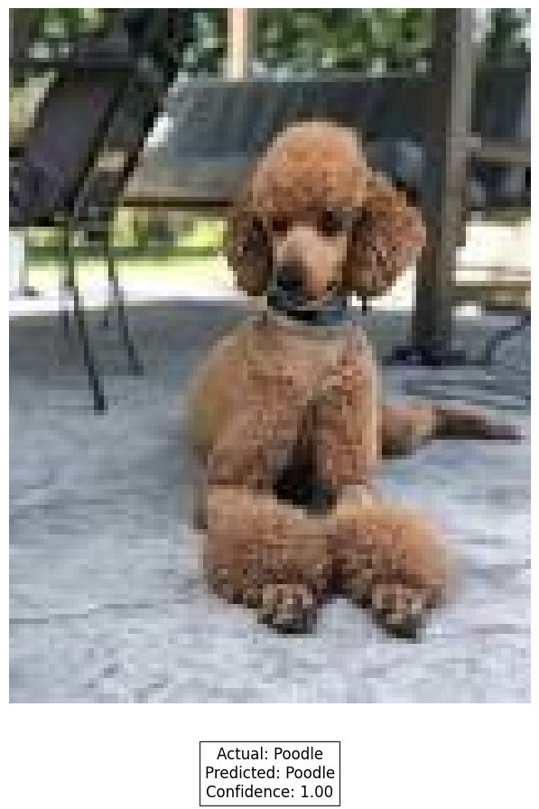
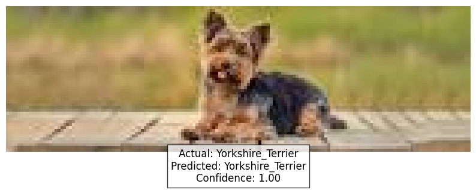
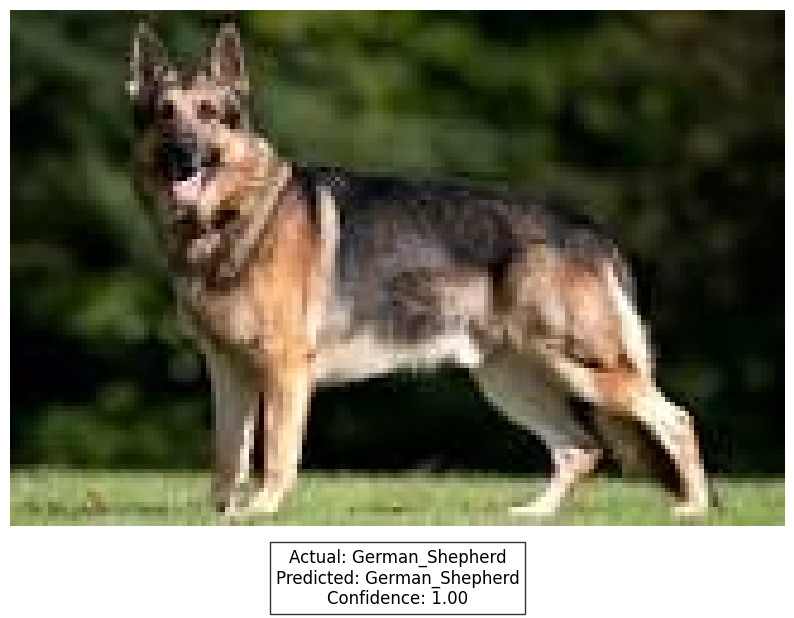
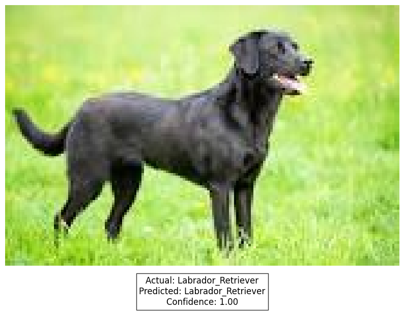
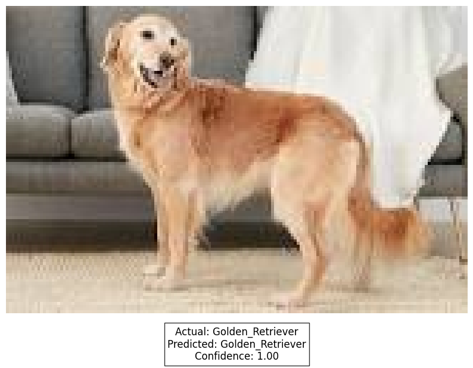
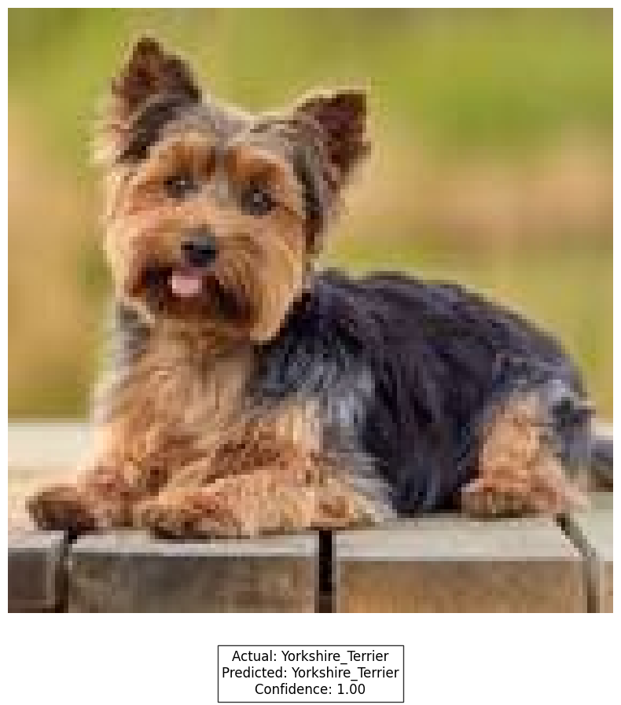
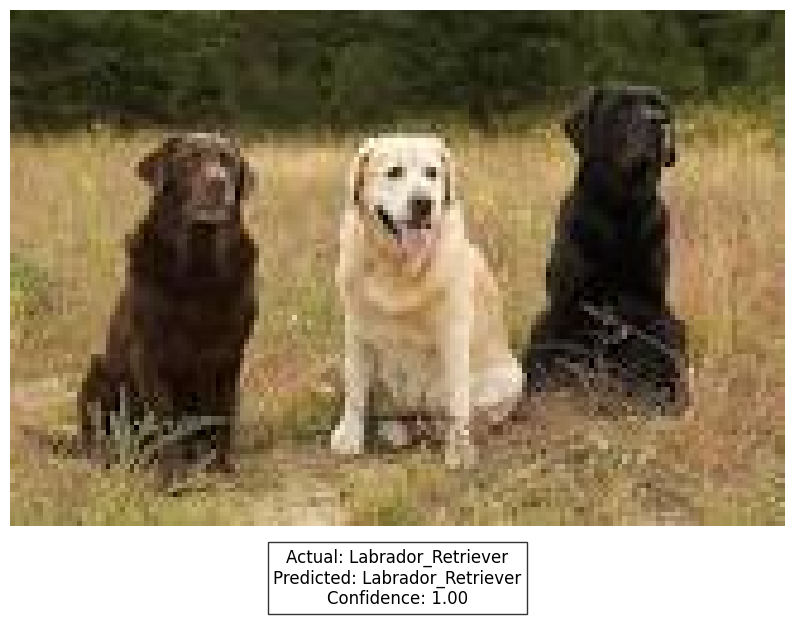
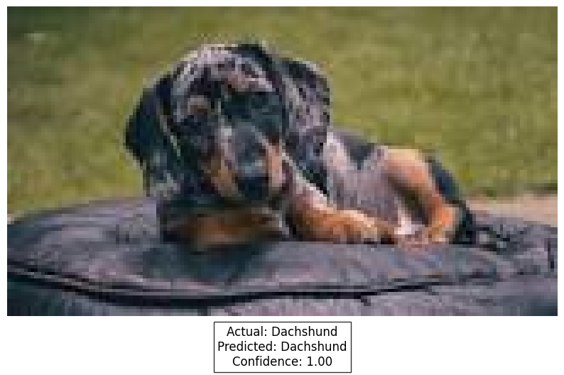
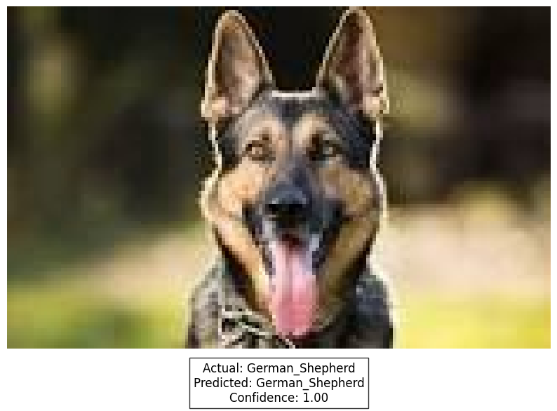
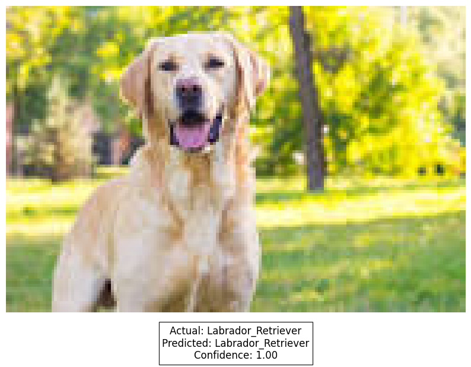

# Dog Breed Classification Project

This project implements a dog breed classification model using PyTorch and PyTorch Lightning, with MobileNetV2 as the base model.

## Project Structure

```
project_root/
├── data/
│   └── dataset/
│       ├── Beagle/
│       ├── Boxer/
│       ├── Bulldog/
│       └── ...
├── datamodule/
│   └── dog_classifier.py
├── model/
│   └── dog_classifier.py
├── model-train/
│   └── train.py
├── model-eval/
│   └── eval.py
├── model-infer/
│   └── infer.py
├── Dockerfile
├── docker-compose.yml
├── requirements.txt
└── README.md
```

## Setup

1. Clone this repository:
   ```
   git clone https://github.com/yourusername/dog-breed-classification.git
   cd dog-breed-classification
   ```

2. Prepare your dataset:
   - Place your dog breed images in the `data/dataset` directory.
   - Each breed should have its own subdirectory (e.g., `data/dataset/Beagle`, `data/dataset/Boxer`, etc.).
   - Ensure each subdirectory contains only image files (jpg, jpeg, png, bmp, or tiff).

## Running Locally

If you want to run the project locally without Docker:

1. Create and activate a virtual environment:
   ```
   python3 -m venv venv
   source venv/bin/activate  # On Windows, use: venv\Scripts\activate
   ```

2. Install the required packages:
   ```
   pip install -r requirements.txt
   ```

3. Run the scripts:
   - Training: `python model-train/train.py`
   - Evaluation: `python model-eval/eval.py`
   - Inference: `python model-infer/infer.py`

## Using Docker Compose

To run the project using Docker Compose:

1. Make sure you have Docker and Docker Compose installed on your system.

2. Build the Docker image:
   ```
   docker-compose build
   ```

3. Run the services:
   - For training:
     ```
     docker-compose run train
     ```
   - For evaluation:
     ```
     docker-compose run evaluate
     ```
   - For inference:
     ```
     docker-compose run infer
     ```

These commands will run the respective scripts inside Docker containers. A data volume is used to persist data between runs.

## Note

Make sure to adjust the `num_classes` parameter in the `DogBreedClassifier` initialization if your dataset has a different number of dog breeds.

If you encounter any issues or need further assistance, please open an issue in the GitHub repository.

Results

<table>
  <tr>
    <td><div style="text-align: center;"><br>Actual: Poodle <br> Predicted: Poodle <br> (Confidence: 1)</div></td>
    <td><div style="text-align: center;"><br>Actual: Yorkshire_Terrier <br> Predicted: Yorkshire_Terrier <br> (Confidence: 1)</div></td>
    <td><div style="text-align: center;"><br>Actual: German_Shepherd <br> Predicted: German_Shepherd <br> (Confidence: 1)</div></td>
    <td><div style="text-align: center;"><br>Actual: Labrador_Retriever <br> Predicted: Labrador_Retriever <br> (Confidence: 1)</div></td>
    <td><div style="text-align: center;"><br>Actual: Golden_Retriever <br> Predicted: Golden_Retriever <br> (Confidence: 1)</div></td>
    <td><div style="text-align: center;"><br>Actual: Yorkshire_Terrier <br> Predicted: Yorkshire_Terrier <br> (Confidence: 1)</div></td>
    <td><div style="text-align: center;"><br>Actual: Labrador_Retriever <br> Predicted: Labrador_Retriever <br> (Confidence: 1)</div></td>
    <td><div style="text-align: center;"><br>Actual: Dachshund <br> Predicted: Dachshund <br> (Confidence: 1)</div></td>
    <td><div style="text-align: center;"><br>Actual: German_Shepherd <br> Predicted: German_Shepherd <br> (Confidence: 1)</div></td>
    <td><div style="text-align: center;"><br>Actual: Labrador_Retriever <br> Predicted: Labrador_Retriever <br> (Confidence: 1)</div></td>
  </tr>
</table>